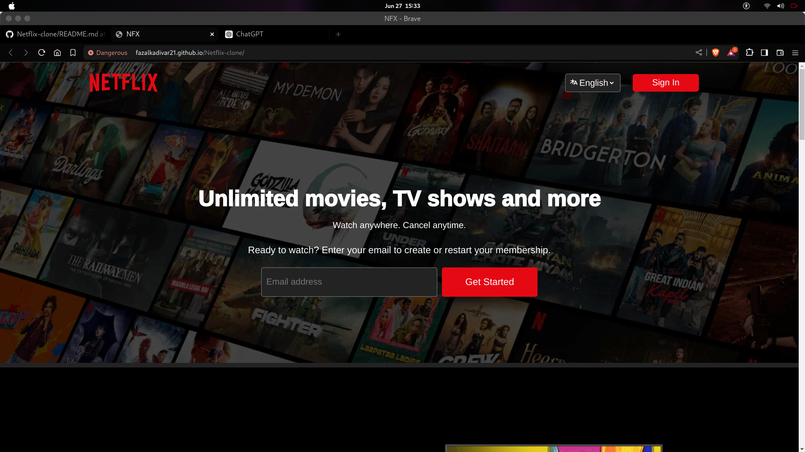

# Netflix Clone Project

## Overview
Welcome to my Netflix Clone project! This is a fun and educational project where I have recreated the user interface of Netflix. While it's not a fully functional clone, it closely resembles the original Netflix website. As I continue to learn and improve my skills, I will be adding more functionalities and features to this project.

## Flaged
This clone is flagged by google so can't visit it directly on the website since you will be seeing warnings here are some screen-shots.




6


## Features
- **Home Page**: The main Netflix page layout with a responsive design.
- **UI Elements**: Includes similar styling, fonts, and layout to mimic Netflix.
- **Navigation Bar**: Replicates Netflix’s navigation bar.

## Technologies Used
- **HTML**: Structure of the web page.
- **CSS**: Styling the web page to look like Netflix.
- **JavaScript**: Basic interactivity and functionality.

## Installation
To run this project locally, follow these steps:

1. **Clone the repository**:
    ```bash
    git clone https://github.com/fazalkadivar21/netflix-clone.git
    ```

2. **Navigate to the project directory**:
    ```bash
    cd netflix-clone
    ```

3. **Open `index.html` in your browser**:
    ```bash
    open index.html
    ```

## Usage
Once you open `index.html` in your browser, you should see a replica of the Netflix home page. You can navigate through the sections and see the static content styled similarly to Netflix.

## Roadmap
Here are some of the features and functionalities I plan to add in the future:
- **User Authentication**: Sign up and login functionality.
- **Dynamic Content**: Fetching and displaying movies and shows from a database or API.
- **Search Functionality**: Allow users to search for their favorite shows and movies.
- **User Profiles**: Multiple user profiles with personalized content.
- **Playback Feature**: Ability to play video content.

## Contributing
I welcome contributions to this project. If you have suggestions for improvements or new features, feel free to open an issue or submit a pull request. Please make sure to follow the contribution guidelines.

## Contact
If you have any questions or want to connect, feel free to reach out:

- **Twitter**: [FazalKadivar21](https://twitter.com/FazalKadivar21)
- **GitHub**: [FazalKadivar21](https://github.com/FazalKadivar21)

## License
This project is licensed under the MIT License. See the [LICENSE](LICENSE) file for details.

---

Thank you for checking out my Netflix Clone project! Stay tuned for more updates and improvements.